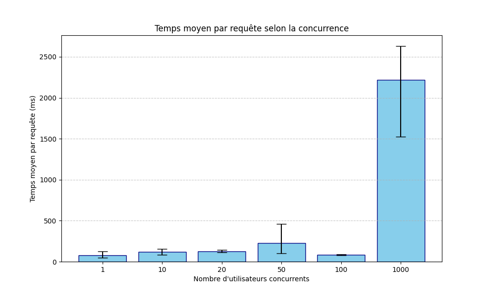
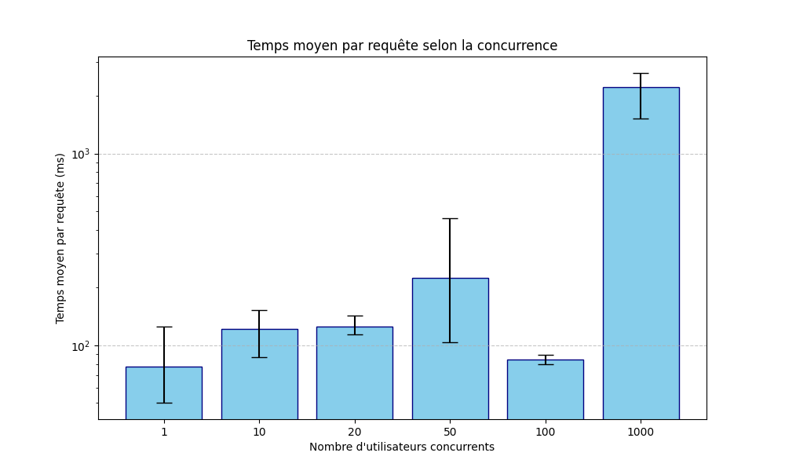
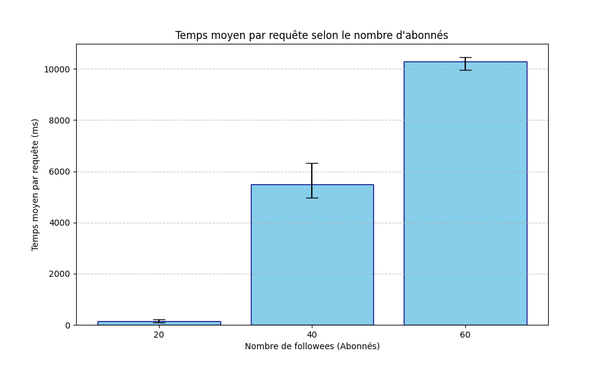

# TinyInsta checker
Fait par Firmin EON - M1 MIAGE

Projet de test de scalabilité pour le projet https://github.com/momo54/massive-gcp

Le projet TinyInsta est déployé à cette adresse : https://tinyinsta-gcp.ew.r.appspot.com/

## Résultats

### Expérience 1 - Passage à l'échelle sur la charge
Cette expérience consiste à l'envoi simultané de requêtes au serveur.

En analysant le fichier [csv](out/conc.csv), il apparait que le nombre de serveur reste à 1 jusqu'à 20 utilisateurs simultané. Lorsque les 50 utilisateurs arrivent, un nouveau serveur est alloué, ce qui prend du temps. Au total, on arrive à 4 serveurs à la fin des trois runs à 50 utilisateurs.
Les serveurs sont déjà démarrés donc pour 100 utilisateurs le temps est plus faible que pour 50 (pas de démarrage de serveurs).
Pour 1 000, 12 serveurs doivent démarrer, ce qui implique un temps plus conséquent.

En utilisant une échelle logarithmique, on obtient le graphique suivant :

En analysant ce graphique, cela nous confirme que pour 50 utilisateurs on a atteint un palier et que de nouveaux serveurs sont alloués. Cela permet aux 100 ultilisateurs simultanés d'être plus rapide.

En excluant le temps de démarrage des serveurs, l'application passe à l'échelle sur la charge.

### Expérience 2 - Passage à l'échelle sur les données
Cette expérience consite à la récupération d'une timeline en prenant en augmentant les données à récupérer.

En analysant le fichier [csv](out/fanout.csv), il apparaît clairement que plus la quantité de personne que l'on suit augmente, plus le temps de la requête augmente. Le nombre de post a été doublé, ce qui implique un nombre de serveur plus important que l'expérience une pour les même paramêtres (50 users simultanés et 20 abonnements).

On voit ici clairement que l'application ne passe pas à l'échelle sur les données.

### Conclusion
Avec ces deux expérience, on peut voir que le modèle choisit ne passe pas à l'échelle. Il faut donc étudier un autre moyen de faire pour que l'application puisse scale.

## Réalisation
Pour réaliser ce projet, je me suis aidé de Gemini.
J'ai divisé en plusieurs étapes (suppression de la base, remplissage de la base, expérience 1 et 2) et lui ai demandé de me générer le code pour chacune de ces étapes.
J'ai cherché à comprendre le code produit à chaque fois et ait corrigé des erreurs.
L'utilisation de l'IA m'a permis d'aller plus vite dans le processus de développement, mais également de comprendre comment fonctionnait Locust et la bibliothèque google cloud.
